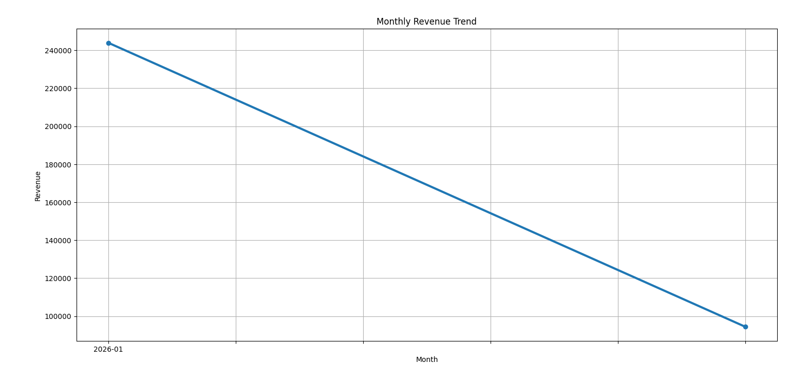

# 📊 E-commerce Sales Analysis using Python


---

## 🚀 Project Overview

Advanced E-commerce Sales Analytics project built using Python to generate business insights like revenue trends, category sales, customer performance, and city analysis.

---

## 🛠 Tech Stack

- Python
- Pandas
- Matplotlib
- CSV Dataset
- VS Code
- GitHub

---

## 📌 Features

✅ Revenue Analysis  
✅ Monthly Trend Analysis  
✅ Top Customers  
✅ Category Performance  
✅ City-wise Sales  
✅ Business Insights  
✅ Dashboard Charts

---

## 📈 Monthly Revenue Trend



---

## 📂 Files Included

- sales_analysis.py
- sales_data.csv
- Figure_1.png
- README.md

---

## ▶️ Run Project

```bash
pip install pandas matplotlib
python sales_analysis.py

## 📈 Monthly Revenue Trend


